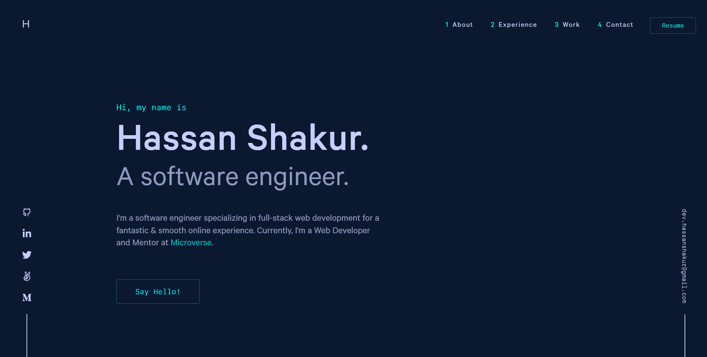

<!-- <div align="center">
  <br />
</div> -->
<h1 align="center">
  <br />
  hassanshakur - Personal Portfolio
</h1>
<p align="center">
  Welcome to my portfolio <a href="https://hassanshakur.vercel.app" target="_blank">hassanshakur</a>, built with <a href="https://nextjs.org/" target="_blank">Next.js</a> and hosted with <a href="https://www.vercel.com/" target="_blank">Vercel</a>
</p>
<p align="center">
  Hosting status
</p>

<p align="center">
  <a href="https://vercel.com/hassanshakur/portfolio" target="_blank">
  
</a>

</p>

<br />



<br />

## 🪄 Installation & Set Up

1. **Clone this repository.**

   ```shell
   git clone https://github.com/hassanshakur/portfolio.git
   ```

2. **Install dependencies.**

   ```shell
   cd portfolio/

   npm install
   ```

3. **Start the development server.**

   ```shell
   npm run dev
   ```

   Your site is now running at `http://localhost:3000`!

4. **Open the source code and start editing!**

<br />

## 🚀 Building for production

1. **Generate a full static production build.**

   ```shell
   npm run build
   ```

2. **Preview the site as it will appear once deployed.**

   ```shell
    npm start
   ```

   Your site is now running at `http://localhost:3000`!

<br />

## 🧐 What's inside?

A quick look at the top-level files and directories you'll see in this project.

    .
    ├── app
    ├── components
    ├── data
    ├── fonts
    ├── helpers
    ├── images
    ├── public
    ├── redux
    ├── types
    ├── .eslintrc.json
    ├── .gitignore
    ├── LICENSE
    ├── README.md
    ├── next.config.js
    ├── package-lock.json
    ├── package.json
    └── tsconfig.json

<!-- copyright -->

## 📝 License

Licensed under the [MIT License](./LICENSE).
